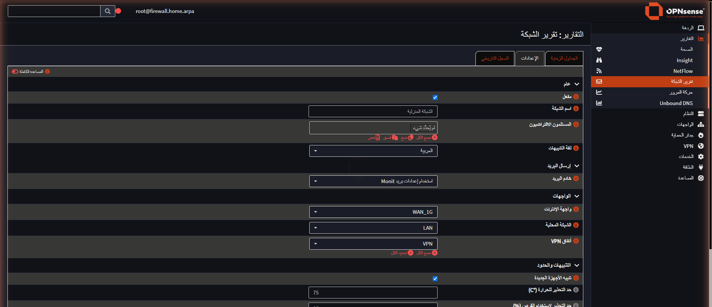
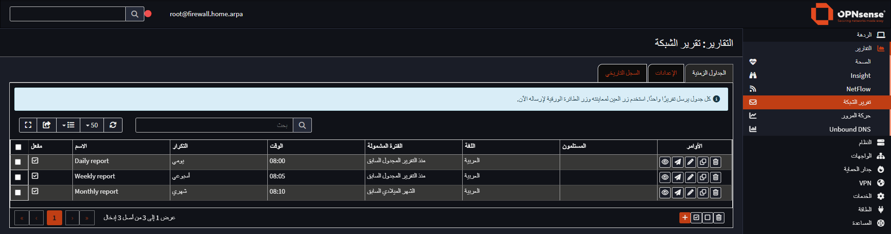

# Right-to-left layout for OPNsense

The OPNsense GUI can be translated into Arabic or Persian, but the page layout stays left to
right: the menu sits on the left, tables and forms are aligned to the left, and dropdowns open
the wrong way. This makes the translated GUI hard to read.

This project mirrors the layout when the GUI language is Arabic or Persian. Every other
language is left untouched.

Tested on OPNsense 26.7 with the opnsense-dark theme. Mirrored stylesheets are generated for
every installed theme, but the others have not been checked page by page yet.

**Status: experimental.** It covers the pages I use daily, but the GUI has several hundred
pages and I have not been through all of them. Reports of pages that look wrong are welcome.



| A table page | A dialog |
| --- | --- |
|  |  |

## What it changes

1. **The page templates** (`default.volt`, `head.inc` and the login page in `authgui.inc`) get
   a `dir="rtl"` attribute when the language is Arabic or Persian, and load a mirrored copy of
   each stylesheet instead of the original.
2. **The stylesheets.** `make_rtl_css.py` writes an `.rtl.css` copy next to every stylesheet
   of the GUI and its themes, with the horizontal geometry flipped:
   - `left`/`right` in property names (`margin-left`, `border-top-right-radius`, ...) and in
     values (`float`, `text-align`, `clear`, `background-position`, ...),
   - four-value shorthands such as `margin` and `padding`,
   - `border-radius` corners,
   - horizontal `translate()` values and resize cursors.

   Icon fonts are not mirrored.
3. **A few manual rules** in `rtl-extra.css` for things the automatic pass cannot fix:
   - inline styles in the templates,
   - chart text (canvas and SVG), which has to stay left to right,
   - fields that hold addresses and commands.

## Installation

Copy the repository to the firewall and run the installer as root:

```sh
fetch -o /tmp/rtl.tar.gz https://github.com/AbdelmonemAwad/opnsense-rtl/archive/refs/heads/main.tar.gz
tar -xzf /tmp/rtl.tar.gz -C /tmp
sh /tmp/opnsense-rtl-main/install.sh
```

Then reload the GUI with Ctrl+F5 so the browser drops the cached stylesheets.

The installer keeps pristine copies of the three templates in `/root/opnsense-rtl/backup`
before changing them, and checks that each patched template still compiles. If one does not,
it puts the original back and stops.

Core updates replace the templates and stylesheets. A boot hook
(`/usr/local/etc/rc.syshook.d/start/61-opnsense-rtl`) applies the changes again. To apply them
right after an update without rebooting, run:

```sh
python3 /root/opnsense-rtl/apply_rtl.py
```

## Removing it

```sh
sh /tmp/opnsense-rtl-main/uninstall.sh
```

This restores the original templates, deletes the mirrored stylesheets and removes the boot
hook.

## Towards upstream

Patching installed files is a stopgap. The proper place for this is OPNsense itself: the
direction attribute in the templates, and the mirrored stylesheets generated when the themes
are built, instead of on the firewall. I intend to propose it there once it has been used for
a while; this repository is the testing ground.

## License

BSD 2-Clause, the same as OPNsense. See [LICENSE](LICENSE).
